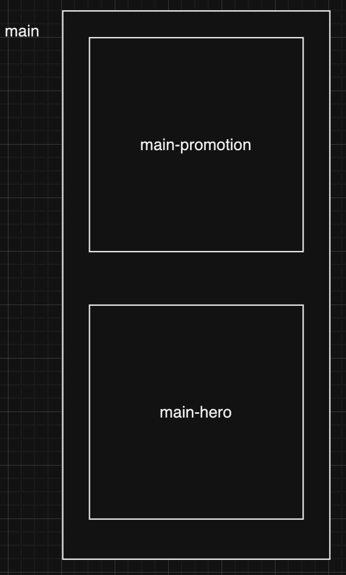

# assignment3 - apple 레이아웃 구현

[과제 링크](https://cocozo.github.io/homework/apple/apple.html)

## 과제에 대한 접근

과제젤 수행하는데 있어 고려해야할 크게 네가지 관건이 있었다.

- 1024px를 기준으로 반응형으로 제작하기.
- 반응형으로 인한 그리드 레이아웃 조정.
- 반응형에 따른 폰트 사이즈 조정.
- 픽셀 밀도에 따른 / 반응형에 따른 이미지 사용

이를 수업시간에 배운 지식 / 개인적으로 어떻게 해결했는지에 대해 이야기 해보겠다.

## 반응형 레이아웃 조정

- 1024px를 기준으로 반응형으로 제작하기.
- 반응형으로 인한 그리드 레이아웃 조정.

반응형 제작을 위해`@container` 를 이용하기로 결정하였다.
레이아웃을 설계할시,

해당 배치로 설계하였는데, `<div>` 태그로 외부를 묶어주고,
`<section>` 을 수직으로 두개를 배치하였다.

메인에 
``` css
    .main {
        container-type: inline-size;
        container-name: main;
    }
```
구문을 주었는데, 해당 구문을 통해 컨테이너 이름과, 컨테이너에서 쓰일 속성을 정의해 주었다.


여기서 `main-hero`의 레이아웃이 바뀌어야 하므로,
``` css
    .main-hero {
    display: grid;
    inline-size: 100%;
    gap: var(--small-spacing);
    grid-template-columns: 1fr;
    grid-template-rows: repeat(4, var(--size));

    @container main (inline-size > 64rem) {
        grid-template-columns: repeat(2, 1fr);
        grid-template-rows: repeat(2, var(--size));
    }
    
}
```
해당 구문처럼 nested문으로 main 의 인라인 요소를 가지고 와 만약 64rem(1024px) 가 넘어가게 된다면, 그리드 요소가 바뀌게 만들었다.

## 반응형에따른 폰트조정

강사님께서 주신 css에 custom property가 정의되어있는 파일에 각각 어떤 사이즈로 크기를 사용해야하는지에 대한 요소가 모두 정의되어 있다. 따라서 해당 정의에 따라 반응형이 적용되어야 할 요소 모두에게

``` css
    .subhead {
        display: block;
        font-size: var(--base-text);
        margin-top: var(--small-spacing);
        z-index: 1;
        line-height: var(--line-normal);
        text-align: center;

        @container main (inline-size > 64rem) {
            font-size: var(--medium-text);
        }
    }
```
와 같은 방식으로, 크기에 따른 사이즈 조정을 하였다.

## 반응형 / 픽셀 밀도에 따른 이미지 조정.

사실 위와 비슷하게 이미지의 반응형 처리를 하였다.
``` css
        &.pad-air {
            background-image: url(../../assets/apple/ipad_air.jpeg);

            @container main (inline-size > 64rem) {
                background-image: url(../../assets/apple/ipad_air_wide.jpeg);
            }
        }
```
하지만, 여기서 추가로 고려해야할 사항이, 픽셀밀도이다.
하지만 픽셀밀도에 관련한 조작법이 기억이 나지 않아... 내가 할수 있는 방법으로 임시로 해결하였다.

바로, 스크립트를 이용한 클래스 조정이다.
먼저, high-density속성을 가진 클래스에 대한 설정을 한다

``` css
        &.pad-air.high-density {
            background-image: url(../../assets/apple/ipad_air_2x.jpeg);

            @container main (inline-size > 64rem) {
                background-image: url(../../assets/apple/ipad_air_wide_2x.jpeg);
            }
        }
```

이제 스크립트를 이용하여 픽셀 밀도를 가져오고, 일정 수치 이상의 밀도를 가지면, 모든 백그라운드 태그에 high-density클래스를 추가한다.

``` javascript
      const RATIO = window.devicePixelRatio;

      if(RATIO >= 2) {
        console.log("high pixel density! change high quality image!")
        const backgrounds = document.querySelectorAll(".background");
        backgrounds.forEach((element) => {
          element.classList.add("high-density");
        });
      }
```

해당구문을 통해 각기다른 이미지 적용이 가능했다.
지금은 해당 방식으로 문제를 해결했으나... 나중에 스크립트를 배제한 방법이 있다면 그 방법으로 다시 제작해보고 싶다.